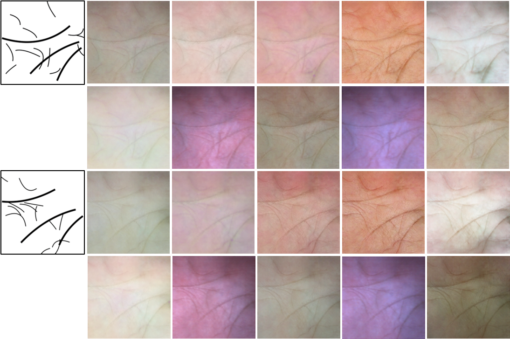

# RPG-Palm
`RPG-Palm Realistic Pseudo-data Generation for Palmprint Recognition` |  [Paper](https://openaccess.thecvf.com/content/ICCV2023/papers/Shen_RPG-Palm_Realistic_Pseudo-data_Generation_for_Palmprint_Recognition_ICCV_2023_paper.pdf) | [Arxiv](https://arxiv.org/abs/2307.14016)


Pytorch implementation for RPG-Palm .


## Example results
  


## Prerequisites
- Python 3
- CPU or NVIDIA GPU + CUDA CuDNN

## Getting Started ###

This code borrows heavily from the [BicycleGAN](https://github.com/junyanz/BicycleGAN/tree/master) repository. You can find more details about the original code in the [BicycleGAN](https://github.com/junyanz/BicycleGAN) repository.

### Installation
- Clone this repo:
```bash
git clone https://github.com/Ukuer/rpg-palm.git
cd rpg-palm
``` 
- Install PyTorch and dependencies from http://pytorch.org
- Install python libraries [visdom](https://github.com/facebookresearch/visdom), [dominate](https://github.com/Knio/dominate), and [moviepy](https://github.com/Zulko/moviepy).   
- **Noted that do not install vlkit from pypi**, because it is not compatible with the current version. Please install vlkit as following:
```bash
pip install palm-recognition/vlkit-0.1.0b11.tar.gz 
```

### Use a Pre-trained Model
- Download [checkpoints](https://drive.google.com/file/d/1P-Z2lem3lRCu99oEReJhzYwBP6dzCuMn/view?usp=drive_link) and place it in `./checkpoints `.

- Then `bash ./run_rpg.sh`
- Noted that you should modify some contents in `./run_rpg.sh` to meet you requirements.

### Model Training
- To train a model,
```bash
bash train.sh
```
- To view training results and loss plots, run `python -m visdom.server` and click the URL http://localhost:8097. To see more intermediate results, check out  `./checkpoints/NAME/web/index.html`


### Citation

If you find this useful for your research, please use the following.

```
@inproceedings{shen2023rpg,
  title={RPG-Palm: Realistic Pseudo-data Generation for Palmprint Recognition},
  author={Shen, Lei and Jin, Jianlong and Zhang, Ruixin and Li, Huaen and Zhao, Kai and Zhang, Yingyi and Zhang, Jingyun and Ding, Shouhong and Zhao, Yang and Jia, Wei},
  booktitle={Proceedings of the IEEE/CVF International Conference on Computer Vision},
  pages={19605--19616},
  year={2023}
}
```

If you have any questions or encounter any issues with the RPG-PALM code, please feel free to contact me (email: jianlong@mail.hfut.edu.cn). 
I would be more than happy to assist you in any way I can.

### Acknowledgements

This code borrows heavily from the [BicycleGAN](https://github.com/junyanz/BicycleGAN/tree/master) repository.